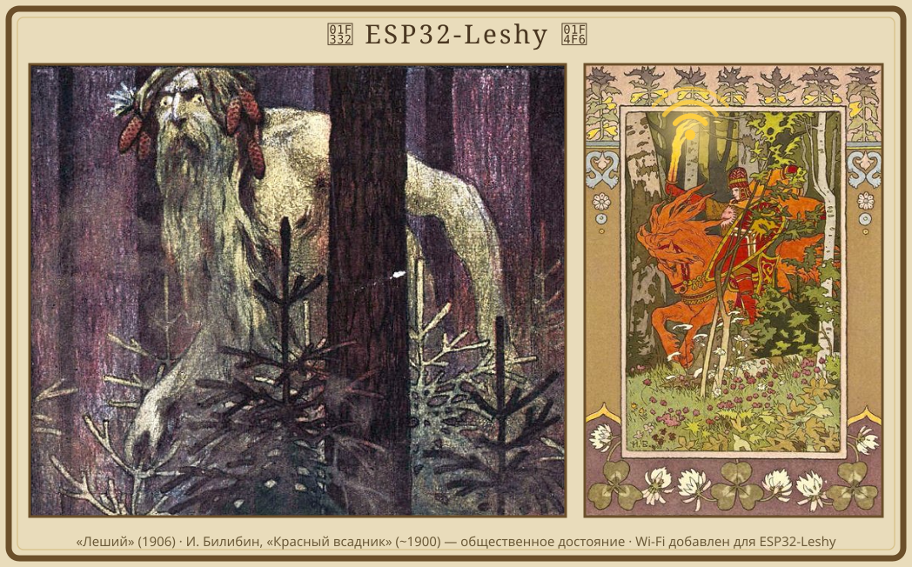
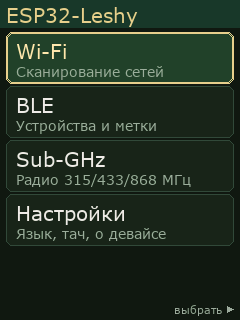

  

# ESP32-Leshy 0.x

> **Архив PoC-линейки.** Эта страница и соседние документы описывают прошивку 0.x.
> Активная разработка перенесена в [ESP32-Leshy 1.x](../../../README.ru.md).

*Читать на: [English](README.md) · **Русский***

**Игривая альтернативная прошивка в духе трикстера для мультитула [ESP32-DIV](https://github.com/cifertech/ESP32-DIV).**

> То же отличное железо — с характером проказника. 😈

> 🛑 **Только своё оборудование.** ESP32-Leshy — **образовательный** проект по **исследованию безопасности**. Применяйте его **только** к сетям, устройствам и радио, которые вам **принадлежат** или на тест которых есть **явное письменное разрешение**. **Никогда** не направляйте эти инструменты на чужое — ни на Wi-Fi соседа, ни на чужой телефон, ни на чью-то сигнализацию или машину. Полные условия: **[DISCLAIMER.ru.md](../../../DISCLAIMER.ru.md)**.

> ⚡ **[Залить из браузера →](https://anton-vinogradov.github.io/esp32-leshy/)** — без тулчейна, нужен только Chrome/Edge и кабель USB-C. После первой заливки обновления прилетают по воздуху.

> ⚠️ **Архивный статус.** Это рабочий menu-driven PoC. Линейка 0.x теперь
> заморожена; продуктовая разработка продолжается в 1.x.

---

   
  <i>Интерфейс, снятый вживую с устройства.</i>

## Что это?

еред тобой независимая прошивка, написанная с нуля под отличный беспроводной мультитул **ESP32-DIV** от [CiferTech](https://github.com/cifertech/ESP32-DIV): та же плата на ESP32-S3 с дисплеем, NRF24, CC1101, RFID/NFC, GPS и ИК.

**ESP32-DIV от CiferTech — и плата, и прошивка — прекрасный, щедрый open-source проект**, и именно благодаря ему возможен наш. ESP32-Leshy не претендует быть «лучше» — это **другой вкус** со своим характером:

- **игривая тема «трикстера»** — набор про подмену, редиректы и добродушные RF-каверзы вместо грубой силы;
- **свой взгляд на UI** — меню с навигацией кнопками и тачем, настройка Wi-Fi с телефона прямо на экране, двуязычный EN/RU;
- **модульный код** — небольшие отдельные модули, которые легко развивать и на которых удобно учиться.

Нравится ESP32-DIV — **сначала поддержите оригинал** ⭐, Леший просто стоит на его плечах. 🙏

## Почему «Леший»?

еший — дух-оборотень славянского леса. Он не разрушает, а **морочит**: меняет облик, аукается знакомым голосом и **уводит путников не туда**. Ровно наш настрой: оборотничество (спуфинг), увод устройств не туда (редиректы, evil-twin, captive-portal) и игривые каверзы вместо грубой силы.

## Железо

елезо, на котором живёт Леший, — это **ESP32-DIV v2** (ESP32-S3, TFT 2.8" + тач, 3× NRF24L01, CC1101, PN532, GPS NEO-6M, ИК, microSD). Подробности — в [hardware.ru.md](hardware.ru.md). Чтобы запустить Leshy, нужна плата ESP32-DIV (или совместимая DIY-сборка). Железо мы не продаём — берите/собирайте [ESP32-DIV](https://github.com/cifertech/ESP32-DIV).

## Возможности

от что Леший уже умеет — рабочее меню, и всё в нём пассивное, только по своему оборудованию:

- **Wi-Fi** — скан (сигнал, канал, шифр, **вендор**, ★своя, мини-график по точке), **Подробнее** по сети (в т.ч. **WPS-модель** точки) и **Радар**, живые графики занятости 2.4ГГц, сырой спектр 2.4ГГц (NRF24), частотомер 2.4ГГц, раскрытие скрытых SSID, детектор атак и **список клиентов (станций)** со своим радаром.
- **BLE** — список устройств с **тегами типа/бренда**, детектор трекеров (**Apple Локатор** / Tile / SmartTag), полные **Детали** и **радар** для поиска устройства по сигналу.
- **Sub-GHz** (CC1101) — водопад спектра, **частотомер** своего пульта и **запись/повтор** своих OOK/FSK-устройств.
- **Офлайн-база производителей** — называет вендоров Wi-Fi и BLE (Bluetooth SIG company-ID + IEEE OUI) без телефона и интернета.
- **Связь** — вход в свой Wi-Fi с телефона (без клавиатуры); **OTA из релизов GitHub** (SHA-256 + авто-откат, авто-проверка при коннекте).
- Двуязычно **EN / RU**, многоуровневое меню, кнопки **и** тач.

📖 **Полный список функций 0.x и карта меню: [features.ru.md](features.ru.md).**

## ⚖️ Ответственное использование

**Для обучения и тестирования СВОЕГО оборудования. И ничего больше.**

- ✅ **Можно:** свой Wi-Fi, свои устройства и радио — или стенд, на тест которого есть **явное письменное разрешение**.
- 🛑 **Никогда** не направляй на чужое. Без исключений, без «просто проверить», без «всего один раз».
- 🌍 **Законы разных стран разные и меняются** — **ты сам** обязан проверить и соблюдать законы своей юрисдикции. Не предполагай — проверяй. Сомневаешься → считай, что нельзя.
- ⚖️ **Вся ответственность — только на тебе.** Авторы **ответственности не несут**. ПО «как есть», без гарантий.

Текущая сборка — только пассивная/защитная. Любые будущие **наступательные инструменты (включая глушение) будут за замком**, который каждый раз требует подтвердить, что оборудование твоё и что ты соблюдаешь закон.

📜 Полный текст — **тот же, что прошивка показывает при первом запуске** — в **[DISCLAIMER.ru.md](../../../DISCLAIMER.ru.md)**.

## Сборка и участие

Собрать, залить, запустить и выпустить — см. **[DEVELOPING.ru.md](DEVELOPING.ru.md)**. Прошить чистую плату из браузера: **[веб-установщик](https://anton-vinogradov.github.io/esp32-leshy/)**.

Новая линейка 1.x описана в **[продуктовой концепции](../../v1/VISION.ru.md)**,
**[целевой архитектуре](../../v1/ARCHITECTURE.ru.md)** и **[дорожной карте](../../v1/ROADMAP.ru.md)**.

## Лицензия и благодарности

Лицензия — [MIT](../../../LICENSE), в духе оригинального ESP32-DIV.

Отдельное спасибо [CiferTech — ESP32-DIV](https://github.com/cifertech/ESP32-DIV) за железо и оригинальную прошивку (MIT).

**Иллюстрации баннера (общественное достояние):** [«Леший», 1906](https://commons.wikimedia.org/wiki/File:Leshy_(1906).jpg) (из журнала «Леший») и [«Красный всадник»](https://commons.wikimedia.org/wiki/File:Ivan_Bilibin_-_red-rider-illustration-for-the-fairy-tale-vasilisa-the-beautiful-1899.jpg) Ивана Билибина («Василиса Прекрасная», ~1900) — обе в общественном достоянии, через Wikimedia Commons. Мотив Wi-Fi добавлен для проекта.

ESP32-Leshy — **независимая, неофициальная** прошивка, не связана с CiferTech.
