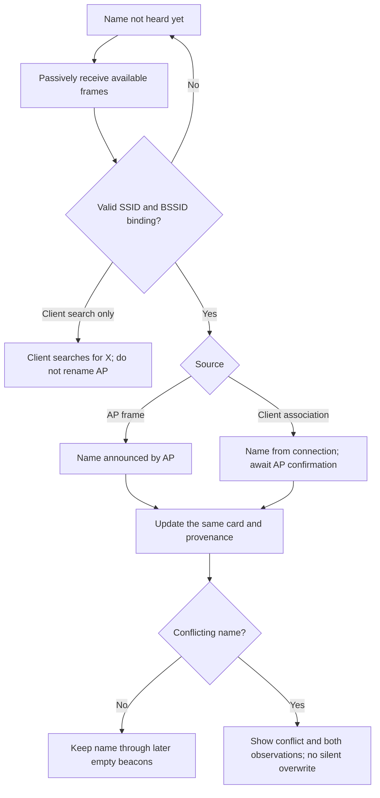

# Wi-Fi — learn everything observable about a network

Read in: **English** · [Русский](WIFI_NETWORK_FACTS.ru.md)

Document: **research and WF-03 enhancement contract**, not a new capability or a
completion claim. [Screen map](WIFI_UX_MAP.md) · [Live status](STATUS.md).
Source review: 13 September 2026. Prioritise information that identifies an owned
network, explains protection/quality and helps choose the next step.

14 September implementation: dev.390 includes the four themed information pages,
pixel-fitted UTF-8/escaped SSIDs and **Name and device → Listen for name**.
Explicit OK/touch starts a passive, selected-channel window of at most 20 seconds.
Other channels pause; Stop/deadline restores ordinary scanning after receiver
cleanup. Opening the page or pressing Right does not start reception.

Host foundation (14 September): [bounded name decoder/tracker](../../firmware/leshy1/src/apps/wifi/WifiNetworkNameEvidence.h)
now accepts complete AP beacon/probe-response and client association/reassociation
frames, preserves 32-byte names, binds BSSID/channel and keeps conflicting names
without changing AP RSSI. Confirmation and name age are separate. Native and
ASan/UBSan tests cover malformed/truncated/duplicate elements and wrong addresses.
The decoder is now wired into that live window and the same AP card. The card
shows AP/client provenance, AP confirmation, age and a conflict warning; first
name evidence is preserved without overwriting RSSI or scan sample counts.
It reuses the foreground radio lease, with no packet queue, SD write or PSRAM
dependency. Static RAM grows by 872 B versus dev.388. A real client-association
positive remains a separate gate; host coverage alone does not close it.

## User presentation

Dev.391 preparation (built; deployment blocked): the ordinary test-network screen
shows a new random WPA2 password while active, never in USB state or on SD.
The listener retains the first client frame independently: a directed AP probe
response can arrive first, so AP-first is not relabelled as client-first.
The display says a connection **frame was heard**, not that authentication,
DHCP or internet succeeded. Phone hardware qualification remains open.

Dev.390 [physical delta](../../tests/hil/evidence/wifi-name-listen-1.0.0-dev.390.json):
20.001 s with no name, live AP-frame name, touch Stop, fresh scan restoration and
13 TFT captures; countdown 26 changed dynamic / zero static pixels. Both boards
finish Home/none/lease 0. This does not prove the real-client branch. The
[earlier failed runs](../../tests/hil/evidence/wifi-name-listen-dev389-390-failures.json)
remain retained; USB diagnostic reliability is not declared solved.

Two-DIV validation follows [the product-firmware rule](GOVERNANCE.md#product-firmware-on-both-divs):
the source is a normal, user-accessible bounded test-network role, not a separate
test binary. The earlier ordinary dev.388 [checked product-menu run](../../tests/hil/evidence/wifi-product-network-1.0.0-dev.388.json)
passed explicit Start, passive same-AP discovery, manual Stop and deadline Stop
(host observed 60.395 s). Eight TFT captures include a countdown delta of
29 dynamic / zero static pixels; both boards end Home/none/lease 0 with zero
final drop counters and SD operations. Final reset counters do not prove a
lossless full session. Reconnection restored boot; the earlier
[startup blocker](../../tests/hil/evidence/wifi-product-network-dev386-boot-blocker.json)
remains retained and its root cause is not conclusively established.
The verified hidden → visible → hidden
beacons check AP-name discovery/retention only; they do not prove learning a name
from a client's association while the AP remains hidden. Both cases need their
own observations. Neither requires the laptop's Wi-Fi.

Product path: **Device → Self-check → Check Wi-Fi**. Entry keeps radio off.
The owner may choose visible/hidden name and explicitly create a 60-second
WPA2 test network on channel 6, named `LESHY-TEST-xxxx` from Leshy's own AP identity.
A second DIV uses **Wi-Fi → Nearby networks**. Visibility may change during
the same session without changing the BSSID or renewing the deadline.
Left, the Stop row, BOOT, deadline, device lock or Safety Stop end transmission;
leaving the page also stops it. Failed cleanup latches safety and resets rather
than releasing a possibly live radio. Opening this tool does not create a
self-test Pass report. It needs no SD.

The accepted source baseline checks discovery only. Dev.391 prepares an owned
phone connection-frame check, with no DHCP, web server, internet, raw injection,
deauthentication or laptop networking.
The driver applies/readbacks a 2 dBm configured power limit after Wi-Fi start;
the SDK startup interval still uses its PHY default, so this is not a claim of
measured power or a 2 dBm ceiling from the first transmitted frame.
Timer text uses the shared retained compositor; unchanged text and controls are
not repainted. The host runner only drives real product key/touch paths and reads
state/TFT pixels; deployment is separate.

Main card: **name → protection → channel → live signal**. Enrich automatically
within the current receive session; do not require a different scanner for every
property. **All information** has four themed branches:

1. **Name and device** — SSID, hidden/resolved name, BSSID, manufacturer/model when
   known, and information source.
2. **Protection** — authentication, ciphers, WPS, management-frame protection.
3. **Radio and quality** — channel/frequency/width, signal/history/age, capabilities.
4. **Observed activity** — transmitters, frames, changes and supporting observations.

Drill down within these sections rather than adding dozens of Home entries.
Keep rare fields out of the summary. Optional technical details contain exact
values and a frame reference only when that frame was actually retained.

## Hidden name: hear it, not decrypt it

Suppressing a name in beacons does not encrypt the SSID. For example, an AP can
answer a directed request from a client that already knows it.
[Cisco: WLAN SSID visibility](https://www.cisco.com/c/en/us/td/docs/wireless/controller/technotes/8-6/b_Cisco_Wireless_LAN_Controller_Configuration_Best_Practices.html).

The proposed passive path uses a selected AP's beacon/probe response or a client's
association/reassociation request bound by addresses to its BSSID. This is a design
inference from frame fields and the existing
[client decoder](../../firmware/leshy1/src/apps/wifi/WifiDeviceCatalog.cpp),
not a claim that SDK scan delivers all such events.

Behaviour:

- Parse the stream already being received. Do not start another competing Wi-Fi
  owner or change channel outside the shared schedule.
- Offer **Listen for name** for the selected hidden AP: an explicit bounded
  session on its channel. Before starting, explain that other channels will stop
  refreshing temporarily. Restore the previous schedule and selected network on exit.
- While waiting: “Name not heard yet. You can connect your own device normally.”
  At the deadline: “Name not heard during this observation.” Not “impossible”,
  “network absent” or “wrong password”.
- Show “Name from client connection” until an agreeing AP announcement is heard.
  Frames can be spoofed: provenance records observations, not authenticated identity.
- Same channel, similar RSSI or a lone probe request cannot rename a hidden AP.
  Equal SSIDs must not merge different BSSIDs; future grouping retains separate radios.
- An empty later SSID must not erase a known name. Never combine an old name,
  recent client RSSI and AP properties into one apparently fresh AP measurement.
- No automatic deauthentication, association, name guessing or Lab fallback.
  The Mac and its Wi-Fi are not involved.

## Useful facts and limits

| Group | Show when available | Limit |
|---|---|---|
| Identity | SSID, BSSID, name source, first/last seen | Names are not unique; key records by BSSID and observation context |
| Manufacturer | OUI inference; announced WPS manufacturer/model/device name | OUI does not prove model; locally administered addresses do not identify a vendor |
| Protection | WPA/WPA2/WPA3, Personal/Enterprise, OWE, ciphers, WPS, PMF | Announced configuration is not a password test or proof of vulnerability |
| Radio | Frequency, primary/secondary channel, width, announced PHY/rates | Advertised capability is not measured throughput |
| Quality | AP RSSI, min/max, history, age, listening duration | Client RSSI is separate; no bearing/distance or internet speed |
| Activity | Observed frame arrival rate; retries when evidence permits | Normalise by actual listening time; observed traffic is not all traffic |
| AP load | Announced BSS Load station count/utilisation | Keep separate from observed-client count and locally measured activity |
| Extra properties | QoS, HT, roaming capabilities, beacon interval, DTIM, country IE | Valid received fields only; missing does not mean disabled |
| Changes | Name/channel/protection changes, conflicting announcements | Change is not proof of attack; show evidence and time |

SSID, RSN/PMF, BSS Load and capability fields are described in the
[Wireshark 802.11 reference](https://www.wireshark.org/docs/dfref/w/wlan.html).
Announced device/manufacturer/model values can come from
[WPS attributes](https://www.wireshark.org/docs/dfref/w/wps.html); APs need not
send them. Do not guess firmware version from OUI or model.

Country IE is an AP's claim, not permission for Leshy to transmit on those channels.
TSF is a synchronisation timer, not verified router uptime. Show 802.11k/v/r
properties with exact provenance, not a heuristic “roaming works” badge.

## Existing implementation and missing integration

| Component | Source-review finding |
|---|---|
| [BoardWifiPassiveScanner](../../firmware/leshy1/src/platform/arduino/BoardWifiPassiveScanner.cpp) | Passive SDK scan with show_hidden; AP SSID/BSSID/RSSI/channel and authentication/cipher/width/PHY/WPS/country/FTM fields |
| [WifiNetworkCatalog](../../firmware/leshy1/src/apps/wifi/WifiNetworkCatalog.cpp) | Identity merge, retention of a supplied non-empty name through empty observations, hidden-resolution counter and signal history |
| [WifiDeviceCatalog](../../firmware/leshy1/src/apps/wifi/WifiDeviceCatalog.cpp) | Client SSID parsing in probe/association/reassociation; BSSID on association. WPS device/manufacturer/model and some PHY facts |
| [ArduinoEntry](../../firmware/leshy1/src/platform/arduino/ArduinoEntry.cpp) | AP catalog consumes survey observations. No end-to-end client-decoder name merge back into the AP card was found |

Thus `hiddenResolutions` is not proof of the whole proposed workflow. Add normalised
management observations and a shared fact merge, not another hidden-network
detector with its own driver.

There is also a text gap: client `copyVisibleText` replaces non-ASCII with `?`,
the SDK path determines length up to NUL, and some UI truncation counts bytes
instead of pixels. Store SSIDs as up to 32 **bytes plus length**, not only a C-string.
Build a separate safe UTF-8/escaped display projection; preserve Cyrillic, avoid
split characters and prevent control sequences. Exact bytes belong in details.

## Fact model and resource contract

Each fact has a value, `unknown / observed / inferred / stale / conflict` state,
`SDK / AP-frame / client-frame / OUI` source, timestamp, channel and BSSID.
Confirmation level is separate from display text. Retain a bounded reference to
an existing capture when recording is enabled; otherwise say “observed, frame not
retained”. A new property must not implicitly start SD recording.

One Wi-Fi owner: a short callback copies bounded observations to a queue;
parsing/merging/rendering run outside it. Verify sniffer behaviour during SDK
scan on **our driver version**. If compatibility is unproven, use explicit
sequential receive windows. Do not promise continuous reception on all channels.
The SDK provides scan and promiscuous APIs, not a guarantee of the application
schedule. [Espressif: ESP32-S3 Wi-Fi API](https://docs.espressif.com/projects/esp-idf/en/stable/esp32s3/api-reference/network/esp_wifi.html).

Use fixed capacities/budgets, drop counters and observation age. Allocation failure
must not wipe the catalog or hang. Render only the visible projection diff:
resolving a name updates its field, not the entire list.

## Hardware and semantic limits

ESP32-S3 receives 2.4 GHz 802.11b/g/n. Advertised extra capabilities do not add
5/6 GHz reception or unsupported-PHY decoding.
[Espressif: ESP32-S3 datasheet](https://documentation.espressif.com/esp32-s3_datasheet_en.pdf).
Three nRF24 modules are not three extra Wi-Fi decoders. The header shows the real
source, not the count of installed antennas.

A passive scan of an arbitrary encrypted network cannot promise IP addresses,
gateway, DNS, LAN hostnames or services. Joining an owned network and read-only LAN
inventory belong to separately admitted WF-20, not a hidden card-opening side
effect. Additional facts may appear in particular unencrypted/authorised captures,
but require provenance. Do not promise the password, encrypted payload contents,
complete client list, actual transmitter power or internet reachability from a beacon.

## Acceptance before claiming completion

1. Hidden beacon → valid AP response → name; association/reassociation → name
   with client provenance → confirmation by an AP frame.
2. Wrong BSSID, isolated client search, equal channel/RSSI do not rename an AP.
3. Empty/zeroed SSID preserves a known name; conflicting non-empty names retain
   history/conflict. Truncated/duplicate IEs, invalid subtype/address/length and
   overflow are rejected without a partially trusted update.
4. A 32-byte SSID, Cyrillic, malformed UTF-8, embedded NUL and control bytes
   preserve identity and render safely.
5. Keep AP/client RSSI separate; age/coverage remain honest during hopping/pause.
   Name changes retain selected identity and alter only the relevant pixels.
6. Short positive HIL on an owned hidden AP with normal owned-client association;
   negative session without a revealing frame; Stop/schedule restoration,
   queue/drop/heap accounting and no transmission/implicit storage writes.

These are future implementation criteria. Publishing the document and mockups
does not run HIL or change firmware.
