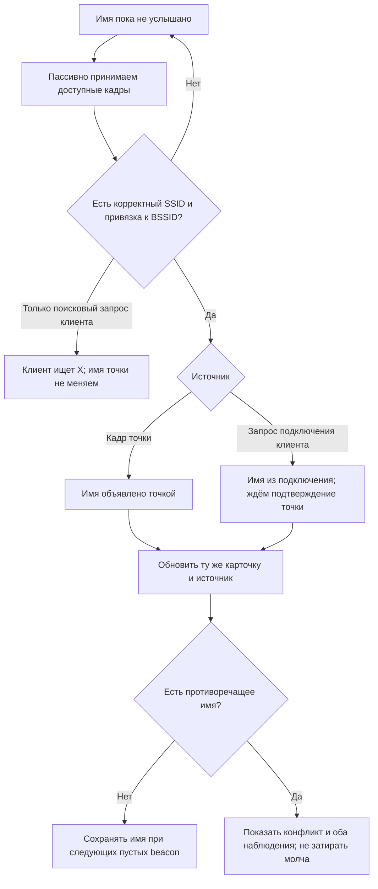

# Wi-Fi — узнать о сети всё наблюдаемое

Читать на: [English](WIFI_NETWORK_FACTS.md) · **Русский**

Документ: **исследование и контракт доработки WF-03**, не новая capability и не
заявление о готовности. [Карта экранов](WIFI_UX_MAP.ru.md) · [Живой статус](STATUS.ru.md).
Проверка исходников: 13 сентября 2026. Приоритет — сведения, которые помогают
опознать свою сеть, понять защиту/качество и выбрать следующий шаг.

Реализация 14 сентября: dev.384 добавляет четыре раздела сведений и безопасную
UTF-8/escaped проекцию SSID с обрезкой по пикселям. Приёмные адаптеры, перенос
имени из клиентского кадра в AP, источники/конфликты и client-association fixture ниже
ещё открыты; изменение UI не заявляет эти измерения.

Host-основа (14 сентября): [ограниченный декодер/трекер имени](../../firmware/leshy1/src/apps/wifi/WifiNetworkNameEvidence.h)
принимает полные beacon/probe-response точки и association/reassociation клиента,
сохраняет 32 байта имени, проверяет BSSID/канал и удерживает противоречия без
изменения RSSI точки. Подтверждение и возраст имени разделены. Native и ASan/UBSan
проверяют повреждённые/усечённые/дублирующиеся элементы и ошибочные адреса.
К живому приёмнику это **ещё не подключено**: окно выбранного канала, возврат
расписания, объединение с карточкой и положительный/отрицательный HIL двух DIV открыты.
Нового владельца радио, глобального RAM-буфера, записи на SD или принятой фичи нет.

## Как это выглядит пользователю

Двухплатная проверка следует [правилу штатной прошивки](GOVERNANCE.ru.md#штатная-прошивка-на-обоих-div):
источник — обычная, доступная пользователю роль ограниченной тестовой сети, а не
отдельный тестовый бинарник. Оба DIV теперь на обычной dev.388;
[проверенный прогон через меню](../../tests/hil/evidence/wifi-product-network-1.0.0-dev.388.json)
прошёл явный Start, пассивное обнаружение той же AP, ручной Stop и Stop по
таймеру (хост заметил через 60,395 с). Восемь снимков TFT включают дельту таймера
29 динамических / ноль статических пикселей; оба DIV завершили Home/none/lease 0,
без drops/операций SD. Переподключение восстановило загрузку; прежний
[startup blocker](../../tests/hil/evidence/wifi-product-network-dev386-boot-blocker.json)
сохранён, его первопричина окончательно не доказана. Проверенная последовательность
скрытый → открытый → скрытый beacon проверяет только получение/сохранение имени AP,
но не получение имени из подключения клиента, пока AP остаётся скрытой. Для этих
двух случаев нужны отдельные наблюдения. Wi-Fi ноутбука ни в одном не используется.

Путь: **Устройство → Самопроверка → Проверить Wi-Fi**. При входе радио выключено.
Пользователь выбирает видимое/скрытое имя и явно создаёт на 60 секунд тестовую
WPA2-сеть на канале 6: `LESHY-TEST-xxxx` из собственной AP identity Лешего.
На втором DIV: **Wi-Fi → Сети рядом**. Видимость имени можно менять в том же
сеансе, без смены BSSID и продления таймера.
Влево, строка Stop, BOOT, таймер, блокировка девайса или Safety Stop выключают
передачу; уход со страницы тоже завершает сеанс. При ошибке cleanup срабатывают
защитная блокировка и reset, а не освобождение возможно работающего радио.
Вход в этот инструмент не создаёт отчёт самопроверки Pass. SD не требуется.

Первый режим источника проверяет только обнаружение: без DHCP, веб-сервера,
интернета, подключения клиента, raw injection, deauthentication и сети ноутбука.
Драйвер задаёт и проверяет настроенный предел 2 dBm после старта Wi-Fi;
в стартовом интервале SDK использует PHY default. Это не измерение мощности
и не гарантия потолка 2 dBm с самого первого переданного кадра.
Текст таймера использует общий retained compositor; неизменившиеся подписи
и элементы не перерисовываются. Host-runner выполняет только реальные
клавишные/сенсорные действия и читает состояние/TFT; деплой вынесен отдельно.

Основная карточка: **имя → защита → канал → живой сигнал**. Всё доступное собирается
автоматически в рамках текущего приёма; для каждого свойства не нужен отдельный
«сканер». Во вложенном **Все сведения** четыре тематических раздела:

1. **Имя и устройство** — SSID, скрытое/раскрытое имя, BSSID, изготовитель и модель,
   если известны, источник сведений.
2. **Защита** — способ подключения, шифры, WPS, защита служебных кадров, пояснения.
3. **Радио и качество** — канал/частота/ширина, уровень/история/давность, возможности.
4. **Что замечено** — передатчики, кадры, изменения и основания выводов.

Детали углубляются внутри этих разделов, а не создают десятки пунктов Home.
Сводка не забивается редкими полями. Необязательный лист «Технические данные»
содержит точные значения и ссылку на кадр, если он действительно сохранён.

## Скрытое имя: не расшифровывать, а услышать

Отключение публикации имени в beacon не шифрует SSID. Например, точка может
ответить на адресный запрос клиента, уже знающего имя.
[Cisco: WLAN SSID visibility](https://www.cisco.com/c/en/us/td/docs/wireless/controller/technotes/8-6/b_Cisco_Wireless_LAN_Controller_Configuration_Best_Practices.html).

Предлагаемый пассивный путь использует SSID из beacon/probe response выбранной
точки либо association/reassociation request, привязанный адресами к её BSSID.
Это вывод из полей кадров и уже имеющегося
[декодера клиентов](../../firmware/leshy1/src/apps/wifi/WifiDeviceCatalog.cpp),
а не обещание, что драйвер scan самостоятельно отдаёт все такие события.

Поведение:

- Автоматически разбирать уже принимаемый поток. Не запускать второй конкурентный
  владелец Wi-Fi и не переключать канал вне общего расписания.
- Для выбранной скрытой точки предложить **«Дослушать имя»**: явный ограниченный
  сеанс на её канале. Перед стартом объяснить, что обзор остальных каналов
  временно не обновляется. При выходе вернуть предыдущее расписание и выбранную сеть.
- Во время ожидания: «Имя пока не услышано. Можно подключить своё устройство
  обычным способом». По окончании: «Имя не услышано за время наблюдения».
  Это не «невозможно», не «сети нет» и не ошибка пароля.
- Из запроса подключения: «Имя: Дом Wi-Fi · из подключения клиента».
  При совпавшем кадре AP: «Имя сообщила точка». Кадры могут быть подделаны:
  источник — свидетельство наблюдения, не криптографическая аутентификация.
- Ни одинаковый канал, ни близкий RSSI, ни одиночный probe request не дают
  основания переименовать скрытую AP. Одинаковый SSID у нескольких BSSID не
  склеивает их в одну точку; будущая группировка должна сохранять отдельные радио.
- Позднейший пустой SSID не стирает известное имя. Не смешивать старое имя,
  недавний RSSI клиента и текущие свойства AP в один «свежий» замер.
- Никакого автоматического deauth, подключения, перебора имён или перехода в Lab.
  Текущий Mac и его Wi-Fi не участвуют в этом процессе.

## Полезные сведения и честные границы

| Группа | Что показывать при наличии | Ограничение |
|---|---|---|
| Идентичность | SSID, BSSID, источник имени, впервые/последний раз замечено | Имя не уникально; идентичность записи — BSSID и контекст наблюдения |
| Производитель | Предположение по OUI; объявленные WPS manufacturer/model/device name | OUI не доказывает модель; локально назначенный адрес не определяет производителя |
| Защита | WPA/WPA2/WPA3, Personal/Enterprise, OWE, шифры, WPS, PMF | Объявленная конфигурация — не проверка пароля и не доказательство уязвимости |
| Радио | Частота, основной/вторичный канал, ширина, PHY/скорости из объявления | Возможности из объявления не равны измеренной скорости передачи |
| Качество | RSSI AP, min/max, история, возраст, время прослушивания | RSSI клиента — отдельный замер; не направление/дистанция и не скорость интернета |
| Активность | Наблюдаемые кадры/скорость поступления, retries при достаточных данных | Нормировать по времени фактического приёма; не выдавать долю увиденных кадров за полный трафик |
| Нагрузка AP | BSS Load: объявленные число станций и utilisation | Не смешивать с нашим счётчиком замеченных клиентов или измеренной занятостью |
| Дополнительные свойства | QoS, HT, roaming capabilities, beacon interval, DTIM, country IE | Только валидные полученные поля; отсутствует ≠ выключено |
| Изменения | Смена имени/канала/защиты, противоречивые объявления | Факт изменения не равен атаке; показать основания и время |

Поля SSID, RSN/PMF, BSS Load и capability information представлены в
[справочнике 802.11 Wireshark](https://www.wireshark.org/docs/dfref/w/wlan.html).
Объявленные имя/производитель/модель доступны через соответствующие
[атрибуты WPS](https://www.wireshark.org/docs/dfref/w/wps.html), но точка не обязана
их передавать. Версию прошивки не угадывать по OUI или модели.

Country IE — заявление точки, не разрешение Лешему передавать на этих каналах.
TSF — таймер синхронизации, не доказанные часы работы роутера.
Свойства 802.11k/v/r стоит показывать только с точным источником, а не одним
эвристическим значком «роуминг работает».

## Что уже есть в исходниках, чего ещё нет

| Компонент | Наблюдение при ревью |
|---|---|
| [BoardWifiPassiveScanner](../../firmware/leshy1/src/platform/arduino/BoardWifiPassiveScanner.cpp) | Пассивный SDK scan с show_hidden; SSID/BSSID/RSSI/channel, auth/ciphers/width/PHY/WPS/country/FTM из AP record |
| [WifiNetworkCatalog](../../firmware/leshy1/src/apps/wifi/WifiNetworkCatalog.cpp) | Объединение по идентичности, сохранение непустого имени после пустого, счётчик hidden resolutions, signal history |
| [WifiDeviceCatalog](../../firmware/leshy1/src/apps/wifi/WifiDeviceCatalog.cpp) | Декодирует SSID клиента в probe/association/reassociation; association содержит BSSID. Есть WPS device/manufacturer/model и часть PHY-фактов |
| [ArduinoEntry](../../firmware/leshy1/src/platform/arduino/ArduinoEntry.cpp) | Каталог AP заполняется survey-наблюдениями. Сквозного объединения имени из клиентского декодера обратно в карточку AP при ревью не найдено |

Следовательно, существующий `hiddenResolutions` не является доказательством
всего нового сценария. Нужны нормализованные management observations и единое
объединение фактов; не отдельный «детектор скрытой сети» поверх второго драйвера.

Есть и текстовый пробел: клиентский `copyVisibleText` заменяет не-ASCII на
`?`, SDK-путь определяет длину до NUL, UI местами обрезает байты вместо
пиксельной ширины. Сохранять SSID как до 32 **байт с длиной**, не только C-string.
Отдельно строить безопасный UTF-8/escaped display; не терять кириллицу, не разрывать
символ и не допускать управляющие последовательности. Сырые байты — в деталях.

## Модель факта и ресурсный контракт

Каждый факт: значение, состояние `unknown / observed / inferred / stale / conflict`,
источник `SDK / AP-frame / client-frame / OUI`, время, канал и BSSID.
Уровень подтверждения хранить отдельно от самого текста. Для кадра хранить
bounded ссылку на существующую запись, если запись включена; без записи честно
писать «наблюдалось, кадр не сохранён». Не начинать запись на SD из-за нового поля.

Нужен единый Wi-Fi owner: короткий callback копирует ограниченное наблюдение в
очередь; разбор/объединение/рисование выполняются вне callback. Проверять работу
sniffer во время SDK scan на **нашей версии драйвера**; если совместимость не
подтверждена, использовать явные последовательные окна приёма. Не обещать
одновременный непрерывный приём всех каналов. SDK предоставляет scan и promiscuous
API, но это не гарантия конкретного расписания приложения.
[Espressif: ESP32-S3 Wi-Fi API](https://docs.espressif.com/projects/esp-idf/en/stable/esp32s3/api-reference/network/esp_wifi.html).

Фиксированные capacity/budget, счётчики пропусков и возраст наблюдений; отсутствие
heap-буфера не должно стирать каталог или зависать. Рисование — только по diff
видимой проекции: появление имени меняет соответствующее поле, не весь список.

## Аппаратные и смысловые пределы

Wi-Fi приёмник ESP32-S3 работает в 2,4 ГГц, 802.11b/g/n. Объявления других
возможностей не добавляют приём 5/6 ГГц или декодирование неподдерживаемого PHY.
[Espressif: ESP32-S3 datasheet](https://documentation.espressif.com/esp32-s3_datasheet_en.pdf).
Три nRF24 не являются тремя дополнительными Wi-Fi-декодерами. Верхняя панель
показывает настоящий источник, а не число установленных антенн.

IP, шлюз, DNS, имена LAN-устройств и службы нельзя обещать для произвольной
зашифрованной сети из одного пассивного scan. Подключение к своей сети и read-only
LAN-инвентаризация — отдельный допущенный WF-20, а не скрытый побочный эффект
открытия карточки. В отдельных незашифрованных/разрешённых записях могут быть
дополнительные сведения, но только с указанием источника.
Не обещать чтение пароля, содержимого шифрованных пакетов, полный список клиентов,
реальную мощность передатчика или доступность интернета по одному beacon.

## Проверка до заявления «готово»

1. Скрытый beacon → корректный AP response → имя; association/reassociation
   → имя с клиентским источником → подтверждение кадром AP.
2. Чужой BSSID, одиночный поисковый запрос, совпавший RSSI/канал не меняют имя.
3. Пустой/нулевой SSID не стирает известное; смена непустого имени сохраняет
   противоречие/историю. Переполнения, усечённые/дублирующиеся IE и ошибочные
   subtype/address/длины отклоняются без частичного недостоверного обновления.
4. 32-байтовый SSID, кириллица, некорректный UTF-8, встроенный NUL и управляющие
   байты сохраняют идентичность и безопасно отображаются.
5. AP- и client-RSSI не смешиваются; давность и покрытие честные при hop/pause.
   При переименовании фокус остаётся на том же объекте и меняются только его пиксели.
6. Положительный короткий HIL на своей скрытой AP с обычным подключением своего
   клиента; отрицательный сеанс без нужного кадра; Stop/restore расписания,
   queue/drop/heap и отсутствие передачи/неявной записи проверены.

Эти критерии относятся к будущей реализации. Публикация документа и макетов
не запускает новый HIL и не меняет прошивку.
