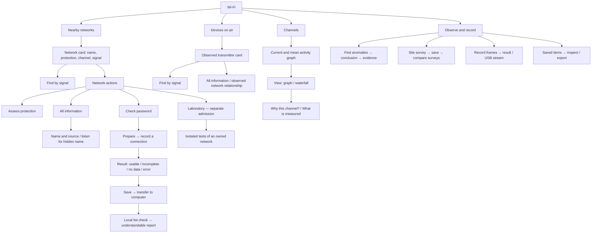

# Wi-Fi — user screen map

Read in: **English** · [Русский](WIFI_UX_MAP.ru.md)

Document: **target UX, with the implementation checkpoint below**.
The agreed direction is a task tree, understandable labels and distinct OK/Right
roles where useful. Publishing mockups does not close implementation or HIL gates.

## Installed checkpoint — 14 September, dev.384

Implemented: Nearby networks → summary → OK signal finder / Right actions →
protection, password preparation, or four information branches (identity,
protection, radio, observations). Key/touch routes preserve the selected AP.
Preparation explains recording a normal connection and checking on a computer;
Right does not start recording. Footer hints are not touch controls.

Shared retained text/radar/bar deltas and pixel-fitted UTF-8 SSIDs are installed.
Eight pages and the graph passed a short exact-image hardware delta: 13 channels,
unchanged static chrome, zero drops/SD operations, final Home/none/lease 0.
[Machine-checked digest](../../tests/hil/evidence/wifi-ui-1.0.0-dev.384.json).
This does not prove optical flicker-free operation on every screen.

Still target design: four-entry Wi-Fi root regrouping, contextual Lab shortcut,
radar pause, expanded hidden-name/source/conflicts and remaining end-to-end wizard
refinements. Observations currently explains RSSI limits; it is not a new per-AP
traffic inspector. Reorganising UI does not increment the feature count.

[Open the interactive map and 240 × 320 mockups](https://anton-vinogradov.github.io/esp32-leshy/v1/wifi-screen-flow.html)
· [Network enrichment, including hidden names](WIFI_NETWORK_FACTS.md)
· [Live status and the fixed Wi-Fi feature list](STATUS.md)

The mockups use synthetic data only. These are representative clickable scenes,
not a firmware emulator or TFT recording. Controls do not scan, transmit or write
to a device. Several sample list rows open one example detail scene; full object
identity is a firmware acceptance concern. The new enrichment research is a
separate specification, not a claim that this prototype already implements it.
The interactive prototype uses Russian labels; this paired document defines the
same navigation contract in English.

## Task tree

Connection and device-address settings stay in **Device → Connection / Privacy**.
A wizard opens the existing settings screen when needed, then returns to its task.
Laboratory inherits the selected target but entering it never starts a test.

## Five physical keys

| Context | Up / Down | Left | Right | OK |
|---|---|---|---|---|
| Menu or object list | Choose row | Parent level | Open | Open |
| Network card | Only when selectable items exist | Return to list | Actions | Find by signal |
| Radar, graph, waterfall | Only an explicitly labelled selection | Back | View / information | Pause / resume |
| Operation preparation | Select parameter | Cancel | Conditions / details | Start after preparation |
| Recording or active operation | Visible selections | Stop first, then result | Inspect without restarting | Stop |
| Result | Choose available action | Parent screen | Other actions | Labelled primary action |
| Final confirmation | Select if needed | Cancel | Does not confirm | Confirm |

OK and Right intentionally remain synonyms in a plain list. Elsewhere,
**Right explores; OK performs its labelled action**. Only Up/Down auto-repeat;
holding a key must not repeat a start or save. Nested paths retain target identity
and a return stack.

The footer contains physical-key hints, not touch buttons. Tapping a menu row
opens it; distinct actions have their own large touch targets. Do not add an
on-screen Back button. Use four rows per screen, Roboto Condensed Medium 16/12
and small inner padding. The compact header holds page title and RX/TX;
brand and version appear only on Home.

## Presentation and honest outcomes

- A card answers “what is it, how well is it heard, what can I do?” Full addresses
  and uncommon properties belong in nested, themed information pages.
- Automatically resolve hidden names only from suitable observations:
  [source, waiting and conflict contract](WIFI_NETWORK_FACTS.md).
- Devices on air means observed transmitters, not a complete router client list.
  Signal finding does not promise bearing, exact distance or location.
- Recommend a channel using the same mean and range shown on the graph, with
  measurement coverage. Unmeasured is unknown, not free. Grey is mean, colour is
  current; units, channel/frequency labels and a legend are mandatory.
- Waterfall: black for no activity, visible Wi-Fi channel boundaries, one new
  one-pixel row per newly measured slice. Do not duplicate a sample into several
  new rows to reach an arbitrary speed. Channel-column width is not additional
  frequency resolution.
- Check password leads through owned-network connection recording, export and a
  local computer check. It does not read the password from the air; “not in this
  list” is not proof of strength. Incomplete captures are not exported as usable
  password-verification material.
- Distinguish “in memory only”, “saved” and “save failed”. Unavailable SD explains
  a save restriction, not a passive-view restriction. Never implicitly enroll
  or format someone else's card.
- Empty, stale, paused, missing receiver, resource conflict, unavailable storage,
  stopped and error states must explain the next step. Timeout is never success.

## Shared rendering, not screen-specific patches

Source review found shared `LiveListRenderCache` and composed list rows, but not
a universal no-flicker guarantee:

| Area | Identified risk | Redesign contract |
|---|---|---|
| Network/device lists | Direct rendering when both buffers fail | Account for fallback explicitly; never erase the whole list |
| Network detail/radar | Clear-before-text; whole-catalog revisions trigger updates | Compare selected object's visible fields; transfer one composed opaque row |
| Channel bars | Raw-number change repaints unchanged pixel height | Compare rendered geometry/colour; update only the changed region |
| Observation results/transitions | Body/row clearing paths remain | Compose each damaged region before transfer, without an intermediate blank |

Audit source:
[ArduinoEntry.cpp](../../firmware/leshy1/src/platform/arduino/ArduinoEntry.cpp),
`renderWifiNetworkRow`, `renderWifiDeviceRow`, `renderWifiNetworkRadar`,
`renderWifiNetworkDetailData`, `renderWifiChannelBar`,
`renderAirspaceGuardRow`, `renderInteractiveScreen`.
This is code analysis, not new optical acceptance.

All lists remain live and strongest-first. Before the first input, focus follows
the first object; afterwards it follows the selected identity, not its row number.
Resolving a name does not change identity. Compose focus last so text/indicators
cannot erase the border. An unchanged visible model produces zero pixel writes.

A page transition can require replacement pixels across the whole screen.
The goal is no visible blank-before-content, not a promise never to update the
screen. An ESP32 buffer is not a TFT hardware page flip and does not prove freedom
from tearing. Use paint/byte/fallback counters and a short video check.

## Coverage of the fixed Wi-Fi scope

This maps existing features to routes; it is not another progress counter.

| Features | Route |
|---|---|
| WF-01, WF-03, WF-04, WF-12 | Nearby networks → card → information / protection |
| WF-02, WF-05 | Devices / network → card → find by signal |
| WF-06 | Channels → view → recommendation explanation |
| WF-07, WF-15 | Observe → record frames / view over USB |
| WF-08, WF-13 | Observe → anomalies → profile → evidence |
| WF-09, WF-10, WF-11 | Network → check password → result → computer |
| WF-14 | Site survey → result → compare / export |
| WF-16, WF-17 | Device → connection / privacy |
| WF-18, WF-19, WF-20, WF-21 | Contextual Laboratory with separate admission |

Earlier WF-03 acceptance covers existing SDK facts and retention of a supplied
name, not the new end-to-end hidden-name path from client frames. These redesign
follow-ups are outside that earlier accepted UX slice; the feature denominator
does not change. The only live progress count remains in [STATUS](STATUS.md).

## Implementation and maintenance order

1. Shared rendering, row identity, five-key semantics and target-preserving return.
2. Networks: themed information, automatic enrichment, hidden name and provenance.
3. Channels: one recommendation metric, graph/waterfall and honest coverage.
4. End-to-end recording/save/export wizards, then remaining admitted Lab gates.

After each slice, update this document, its Russian pair and mockups when routes
change; record actual acceptance in STATUS. Publishing a mockup is not firmware
acceptance. Use delta tests for fixes and a full gate at phase boundaries.

Editable source: [wifi-screen-flow.source.html](wifi-screen-flow.source.html).
Published export: [wifi-screen-flow.html](wifi-screen-flow.html).
After source edits, run `python3 tools/export_wifi_map.py`.
`python3 tools/check_docs.py` checks source/export consistency.
Both files are versioned; the existing Pages workflow publishes after push.
The 0.x installer is unchanged.
