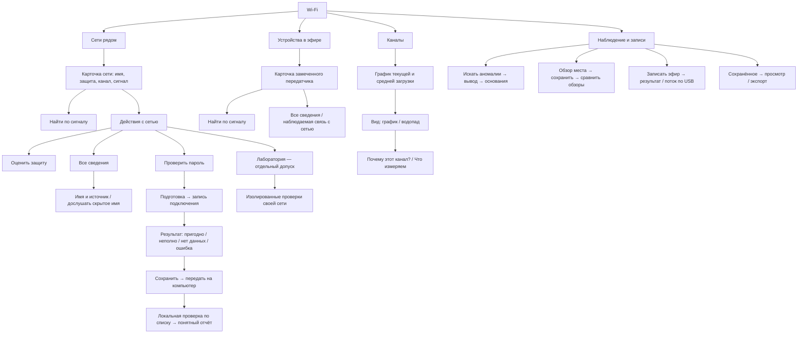

# Wi-Fi — карта пользовательских экранов

Читать на: [English](WIFI_UX_MAP.md) · **Русский**

Документ: **проект доработки UX, не описание уже установленного интерфейса**.
Согласованное направление — дерево задач, понятные названия и разные роли OK/→
там, где это полезно. Публикация макетов не закрывает implementation/HIL gates.

[Открыть интерактивную карту и макеты 240 × 320](https://anton-vinogradov.github.io/esp32-leshy/v1/wifi-screen-flow.html)
· [Что узнаём о сети, включая скрытое имя](WIFI_NETWORK_FACTS.ru.md)
· [Живой статус и фиксированный список Wi-Fi](STATUS.ru.md)

Макеты используют только условные данные. Это кликабельные представительные
сцены, не эмулятор прошивки и не запись TFT. Кнопки ничего не сканируют, не
передают и не сохраняют на прибор. Некоторые строки списка открывают одну
примерную карточку; полный механизм идентичности объектов проверяется в прошивке.
Автоматическое обогащение из нового исследования описано отдельно, а не выдано
за уже работающую кнопку в этом макете.

## Дерево задач

Настройка подключения и собственного адреса прибора остаётся в
**Устройство → Подключение / Приватность**. Мастер при необходимости открывает
этот существующий экран и возвращает к задаче. Не дублируем настройки в Wi-Fi.
Лаборатория получает выбранную цель, но вход в неё сам по себе ничего не запускает.

## Пять клавиш

| Контекст | ↑ / ↓ | ← | → | OK |
|---|---|---|---|---|
| Меню, список объектов | Выбрать строку | На уровень выше | Открыть | Открыть |
| Карточка сети | Только если есть выбираемые элементы | К списку | Действия | Найти по сигналу |
| Радар, график, водопад | Выбор только при явно показанной функции | Назад | Вид / сведения | Пауза / продолжить |
| Подготовка операции | Выбор параметра | Отмена | Условия / детали | Старт после подготовки |
| Запись или активная операция | По показанным элементам | Сначала Стоп, затем итог | Сведения без повторного старта | Стоп |
| Итог | Выбор доступного действия | К родительскому экрану | Другие действия | Главное подписанное действие |
| Окончательное подтверждение | Выбор, если нужен | Отмена | Не подтверждает | Подтвердить |

OK и → остаются синонимами в обычном списке: искусственное различие усложнит вход.
За пределами списка **→ исследует, OK выполняет подписанное действие**.
Удержание повторяет только ↑/↓; нельзя повторить запуск/сохранение автоповтором.
Вложенные переходы сохраняют цель и стек возврата.

Нижняя строка — только подсказки физических клавиш, не touch-кнопки.
Касание строки меню открывает её; отдельные действия имеют собственные крупные
touch-цели. Экранной кнопки «Назад» не добавляем. Четыре строки на экран,
Roboto Condensed Medium 16/12, небольшие внутренние отступы. Компактная верхняя
строка содержит название страницы и RX/TX; бренд с версией — только Home.

## Что показывать и чего не обещать

- Карточка отвечает на вопрос «что это, как слышно, что можно сделать».
  Полные адреса и редкие свойства — во вложенных тематических сведениях.
- Скрытое имя раскрывается автоматически только по подходящим наблюдениям:
  [отдельный контракт источников, ожидания и конфликтов](WIFI_NETWORK_FACTS.ru.md).
- «Устройства в эфире» — замеченные передатчики, не полный список клиентов роутера.
  Поиск по уровню не обещает направление, точное расстояние или местоположение.
- Канал рекомендуем по тому же среднему и диапазону, которые видны на графике;
  показываем покрытие измерениями. Неизмеренные каналы — неизвестные, не свободные.
  Серое — среднее, цветное — текущее; единицы, каналы/частоты и легенда обязательны.
- Водопад: чёрный при отсутствии активности, видимые границы Wi-Fi-каналов,
  одна новая строка в один пиксель на новый измеренный срез. Нет искусственного
  растягивания одного замера на несколько новых строк ради скорости.
  Ширина канального столбца не означает дополнительные частотные измерения.
- «Проверить пароль» ведёт к записи подключения своей сети, экспорту и локальной
  проверке на ПК. Сам пароль из эфира не читается; «не найден в списке» не означает
  доказанную стойкость. Неполные данные не экспортируются как пригодный материал.
- Любая запись различает «только в памяти», «сохранено» и «не удалось сохранить».
  Недоступная SD блокирует сохранение с объяснением, а не просмотр пассивных данных.
  Нет неявной регистрации/форматирования чужой карты.
- Пусто, устарело, пауза, недоступен приёмник, конфликт владельца ресурса,
  недоступно сохранение, остановлено и ошибка — явные состояния с следующим шагом.
  Ни один таймаут не превращается в успешный результат.

## Общая отрисовка, а не отдельные исправления

Исследование исходников выявило, что общий список уже использует
`LiveListRenderCache` и композицию строки, но это ещё не универсальная гарантия:

| Участок | Найденный риск | Контракт доработки |
|---|---|---|
| Списки сетей/устройств | При отказе обоих буферов остаётся прямая отрисовка | Явно учитывать fallback; без очистки всего списка |
| Карточка сети и радар | Очистка поля перед текстом; обновление из-за ревизии всего каталога | Сравнивать видимые поля выбранной сети; готовую непрозрачную строку выводить одним блоком |
| Столбцы каналов | Изменение сырого числа инициирует repaint даже при прежней высоте | Сравнивать пиксельную геометрию/цвет и перерисовывать только изменённую область |
| Результаты наблюдений и переходы | Сохранились ветки очистки тела/строки | Собирать повреждённую область целиком; не показывать промежуточный пустой фон |

Источник аудита:
[ArduinoEntry.cpp](../../firmware/leshy1/src/platform/arduino/ArduinoEntry.cpp),
функции `renderWifiNetworkRow`, `renderWifiDeviceRow`,
`renderWifiNetworkRadar`, `renderWifiNetworkDetailData`,
`renderWifiChannelBar`, `renderAirspaceGuardRow` и `renderInteractiveScreen`.
Это анализ кода, не новое оптическое подтверждение.

Правило для всех списков: сортировка остаётся живой и по убыванию сигнала;
до первого ввода фокус следует за первым объектом, после — за идентичностью
выбранного объекта, а не номером строки. Обновление имени не меняет идентичность.
Рамка рисуется последней в композиции и не затирается обновлением текста/индикатора.
Неизменённая видимая модель означает ноль записей пикселей.

Смена страницы может потребовать новых пикселей по всей площади. Цель — отсутствие
видимой очистки перед готовым содержимым, а не обещание никогда не обновлять экран.
Буфер на ESP32 не является аппаратным page flip TFT и сам по себе не доказывает
отсутствие tearing. Нужны счётчики paint/bytes/fallback и короткая видеопроверка.

## Покрытие зафиксированного Wi-Fi scope

Это маршрутизация существующих функций, не новый счётчик готовности.

| Функции | Путь |
|---|---|
| WF-01, WF-03, WF-04, WF-12 | Сети рядом → карточка → сведения / оценка защиты |
| WF-02, WF-05 | Устройства / сеть → карточка → найти по сигналу |
| WF-06 | Каналы → вид → объяснение рекомендации |
| WF-07, WF-15 | Наблюдение → записать эфир / смотреть по USB |
| WF-08, WF-13 | Наблюдение → аномалии → профиль → основания |
| WF-09, WF-10, WF-11 | Сеть → проверить пароль → результат → ПК |
| WF-14 | Обзор места → результат → сравнить / экспорт |
| WF-16, WF-17 | Устройство → подключение / приватность |
| WF-18, WF-19, WF-20, WF-21 | Контекстная Лаборатория с отдельным допуском |

Прежняя приёмка WF-03 охватывает уже имеющиеся SDK-факты и сохранение полученного
имени, но не доказывает новый сквозной путь скрытого SSID из кадров клиента.
Все открытые доработки этой карты — сверх прежнего принятого UX-среза;
число возможностей не меняется. Единственный живой счётчик — в [STATUS](STATUS.ru.md).

## Очерёдность реализации и обновления карты

1. Общая отрисовка, идентичность строк, пять клавиш и возврат к выбранной цели.
2. Сети: тематические сведения, автоматическое обогащение, скрытое имя и его источник.
3. Каналы: единая метрика рекомендации, график/водопад и честное покрытие.
4. Сквозные мастера записи/сохранения/экспорта, затем оставшиеся допущенные Lab gates.

После каждого среза: обновить этот документ, английскую пару и макеты, если менялся
путь; записать действительную приёмку в STATUS. Не выдавать публикацию макета за
приёмку прошивки. На исправлении — дельта-тесты, на границе фазы — полный gate.

Редактируемый исходник: [wifi-screen-flow.source.html](wifi-screen-flow.source.html).
Публикуемый экспорт: [wifi-screen-flow.html](wifi-screen-flow.html).
После правки исходника выполнить `python3 tools/export_wifi_map.py`.
Совпадение проверяется командой `python3 tools/check_docs.py`.
Оба файла хранятся в Git; existing Pages workflow публикует экспорт после push.
Изменения не затрагивают установщик ветки 0.x.
